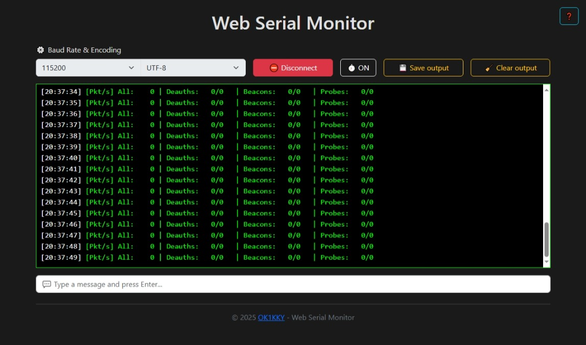

# Web-Serial-Monitor

This web serial monitor allows direct communication with USB devices via the Web Serial API directly in the browser. It is designed as a clear interface with support for selecting baud rate, character encoding, timestamps and saving or deleting output. It works in modern Chromium browsers such as Chrome, Edge, Opera or Brave. The monitor is ideal for debugging devices such as Arduino, ESP32, or other microcontrollers without the need to install external software.

This monitor can be used online for free at [serial.ok1kky.cz](https://serial.ok1kky.cz), without installation. The project is fully open-source, so you can easily host it on your own web server - just upload the HTML file.

